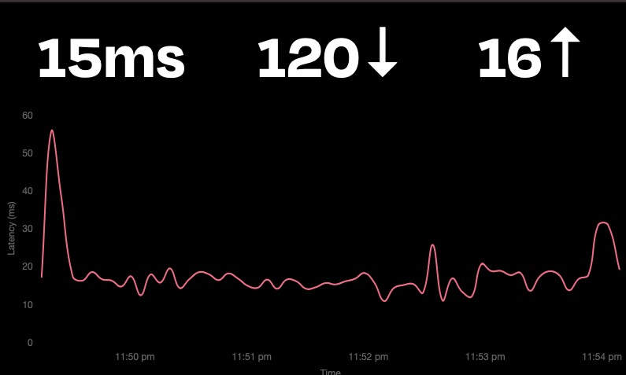
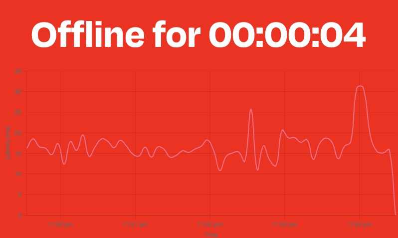

# Network Monitor

I was having an issue with my internet dropping out a lot, so I built this little tool to keep track of when it goes down. Shows a graph of ping speeds over the past 5 minutes (tested every 5 seconds) and the latest speed test (runs every 3 minutes). You can change the intervals in the python file.

It's designed to run on a Raspberry Pi with a small display attached. I'm using the official pi 7" LCD as I had one laying around and it works great, but it should work fine with any other screen. You can also access it from other deivces on the network at http://[ip]:5000

## Features

- **Ping Monitoring**: Displays the ping over time.
- **Speed Monitoring**: Shows download and upload speed.
- **Status Indicator**: Changes the background to red and starts a timer when the network goes down.
- **Graphs**: Visualizes the network latency over the last 5 minutes.

## Screenshots

### Normal Operation


### Offline


## Installation

To install and set up the Network Monitor, follow these steps:

1. Clone the repository:
   ```bash
   git clone https://github.com/xadacka/network-monitor.git
   cd network-monitor```
2. Run the install script:
   ```
   ./install.sh
   ```

## Usage

### Starting the Monitor

The monitor will automatically start on boot. To manually start the monitor, use PM2 commands:

- Start the network monitor:
```
pm2 start /home/pi/network_monitor_env/bin/python --name network_monitor -- /home/pi/network_monitor_project/network_monitor.py
```

- Start Chromium in kiosk mode:
```
pm2 start /home/pi/network_monitor_project/start_monitor.sh --name chromium
```

## API Endpoints

- Get Current Data:
```
GET /data
```

Returns the current latency, download speed, and upload speed.

### Example Response:
```
{
    "latency": 20,
    "network_down": false,
    "speedtest": {
        "download": 50,
        "upload": 10
    }
}
```

- Get Graph Data:

```
GET /graph-data
```

Returns the latency data and timestamps for graph plotting.

### Example Response:

```
{
    "latencies": [20, 30, 25, 40],
    "timestamps": ["2023-06-12 10:00:00", "2023-06-12 10:05:00", "2023-06-12 10:10:00", "2023-06-12 10:15:00"]
}
```

### Simulate Offline Mode:

```
POST /simulate-offline
```

Triggers the offline mode for testing purposes.

- Request Body:

```
{
    "network_down": true
}
```
- Example Request:

```
curl -X POST -H "Content-Type: application/json" -d '{"network_down": true}' http://localhost:5000/simulate-offline
```

- Run Speed Test:

```
POST /run-speedtest
```

Triggers a speed test on demand.

- Example Request:

```
curl -X POST http://localhost:5000/run-speedtest
```

## Contributing

Contributions are welcome! Please feel free to submit a Pull Request.

